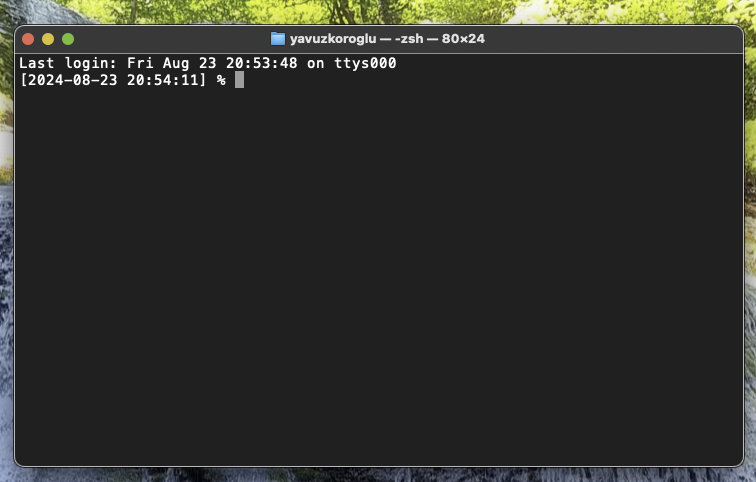
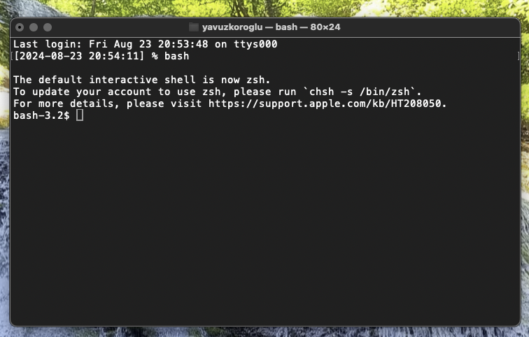
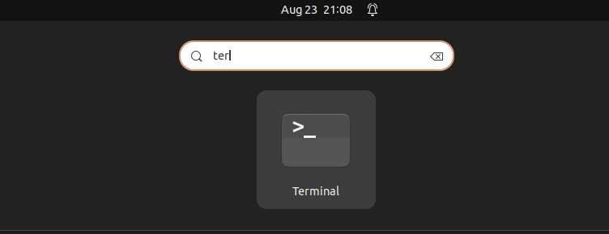
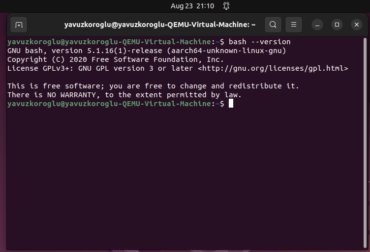
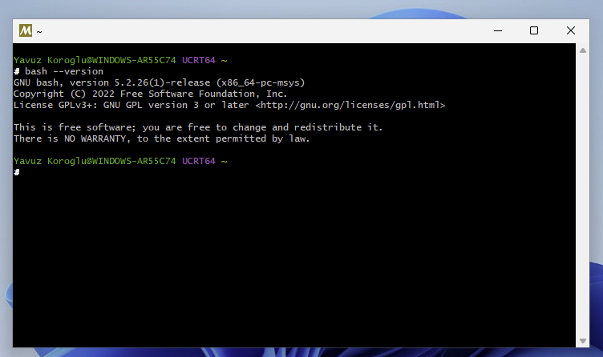

# PADKIT: Portable Application Development KIT for C

# Foreword

> If I do not spend time tidying up my room today, I may use that time more productively. If I leave my room untidy for a month, even all the time in the world cannot make me productive anymore.

No better words can describe the long and tumultuous history of the C programming language. Over half a century, C has endured many questionable coding practices, conventions, and inventions, not by withdrawing all these germs from its syntax and semantics but by accumulating them like swept dust under a carpet. Like the person with whom you cannot stand to be together even for an hour but always miss when you are away, C eventually became the phoenix that revives every time it dies. The effort I put into preparing PADKIT and the time you are willing to spend learning all its twists and turns are testaments - despite the considerable cost - to the need to tidy the room, at least this one time, so that coding may become enjoyable beyond imagination.

# Abstract

Portable Application (App.) Development (Dev.) KIT (PADKIT) is a library of C macros, structs, and functions designed to support the average command-line program developer. C is a popular language among embedded, automotive, and operating system (OS) software developers. For this reason, C has many features that accommodate the low-level needs of these developers. However, for the same reason, C has many confusing features for an average command-line programmer. An excess abundance of C standards, conventions, and principles designed for domain-specific use cases makes it almost impossible to decide on a consistent way of implementing an average command-line program. After forcing myself to implement many ambitious projects solely in C, I have developed a set of best practices, conventions, and principles to write a modern command-line program. I implemented PADKIT using these guidelines. In this documentation, I provide examples to demonstrate the usefulness of PADKIT. I also provide all the design details of PADKIT and the rationale behind them. My main aim is not to promote C as the single most dominant programming language but to propose a novel set of ideas that could change how to approach coding. I believe that if C remains widespread as it is, PADKIT will one day become an essential swiss-knife for the average coder. 

# Table of Contents

- [A. Straight to Business](#a-straight-to-business)
    - [A1. Prerequisites](#a1-prerequisites)
        - [A1i. A Terminal](#a1i-a-terminal)
        - [A1ii. A Text Editor](#a1ii-a-text-editor)
        - [A1iii. Source-Control Management Tool](#a1iii-source-control-management-tool)
        - [A1iv. Compiler Automation Tool](#a1iv-compiler-automation-tool)
        - [A1v. C Compilers](#a1v-c-compilers)
    - [A2. Download PADKIT](#a2-download-padkit)
    - [A3. Compile PADKIT](#a3-compile-padkit)
        - [A3i. Compilation Tools](#a3i-compilation-tools)
        - [A3ii. Compilation Steps](#a3ii-compilation-steps)
    - [A4. Examples](#a4-examples)
        - [A4i. Righttriangle](#a4i-righttriangle)
        - [A4ii. JSONStats](#a4ii-jsonstats)
- [B. Introduction](#b-introduction)
- [Acknowledgment](#acknowledgment) 
- [References](#references)

# A. Straight to Business

This chapter comprises four sections. First, I describe and explain the prerequisites to build and use PADKIT. The next two sections contain the steps to download and build the PADKIT C99 and C23 branches in MacOS, Linux, and Windows platforms. The last section provides some examples to demonstrate how to practically use PADKIT.

## A1. Prerequisites

To use PADKIT, you only need five things:

1. A terminal for MacOS, Linux, or Windows,
2. A text editor (**GEdit**[^1], **nano**[^9], **Vim**[^10], **Emacs**[^11], etc.),
3. The source-control management (SCM) tool, **git**[^12],
4. The compiler automation tool, **make**[^13], and
5. C compilers, **gcc**[^2] and **clang**[^3].

> [!TIP]
> If you have all these five things, you can skip to Section **[A2. Download PADKIT](#a2-download-padkit)**.

### A1i. A Terminal

A **terminal** is a command-line interface (CLI) with which a user interacts. A **terminal** comprises a *shell* and a *window*. A *terminal window* is about aesthetics. So, choosing a *terminal window* is purely a matter of taste. On the other hand, *shell* selection is about functionality and has real consequences for the user. A *shell* is a computer program that exposes OS services to the user [^7]. Having a standard *shell* allows the average coder to use almost the same features across different OS platforms.

> [!IMPORTANT]
> For the average coder, the best shell is the most universal shell.

The reasoning behind the above tip is simple. An average coder is neither interested in small differences between different shell implementations (e.g. between **bash**[^4] and **zsh**[^5]) nor bound to shell features that target a specific OS (e.g. **powershell**[^6]). The average coder's shell should be as much cross-platform as possible. Ideally, the shell should be available in MacOS, Linux, and Windows. Therefore, I deduce that the average coder should prefer **bash**, especially the most commonly available versions of it. Now, I will describe how to use **bash** in MacOS, Linux, and Windows. I use Ubuntu 22.04.4 LTS for Linux examples but feel free to adapt the examples to your preferred Linux distribution.

> [!TIP]
> If you have bash, and familiar with it, you may skip to Section **[A1ii. A Text Editor](#a1ii-a-text-editor)**.

#### MacOS

1. Open the **Terminal.app**. You can use *Spotlight* to locate your application as below.

> [!TIP]
> I use **iTerm2**[^22] instead of **Terminal**. Selecting a terminal window is just a matter of taste.


2. Now, you need to see a terminal window as below. Notice that the title gives away the fact that the shell is **zsh**[^5] and NOT **bash**.



3. Type `bash` and press Enter to start a **bash** session.



#### Linux

1. Open a **Terminal**. On Ubuntu 22.04.4 LTS, it is possible to locate it using the *Show Applications* menu.



2. The default shell in Linux is **bash**[^4]. You can check its version by typing `bash --version` and pressing Enter.



#### Windows

1. Install **MSYS2**[^8].

2. Open **MSYS2**.

3. The default **MSYS2** shell is **bash**. You can check the **bash** version by typing `bash --version` and pressing Enter.



### A1ii. A Text Editor

A text editor is necessary to write code. Text editors, like terminals, comprise a text window and text features. The average coder must carefully select the text editor, according to the text features.

> [!IMPORTANT]
> A good text editor must NOT do the coding for the average coder.

Many powerful integrated development environments (IDEs) supposedly facilitate "coding" by automatically generating code snippets and performing automatic code completion. At first glance, you might think that these text features are designed to help the average coder. In fact, they are more useful for the advanced coder and potentially harmful for the average coder. The average coder may not know many features of a programming language, especially in the case of a low-level language, like C. The automatic coding experience produces working code at the expense of the learning experience, i.e., the average coder learns to rely on the IDE too much instead of learning the fine details of the programming language. Then, the best practice is to start by avoiding IDEs, using a simple text editor. When the coder feels that he/she comprehends every line of his/her code, i.e., can describe what that line does along with potential caveats, then he/she may consider upgrading to an IDE.

#### Avoid These Text Features

1. Automatic code generation
2. Automatic code completion
3. Automatic code repair

> [!IMPORTANT]
> A good text editor must facilitate code reviewing and refactoring.

The average coder must accept the fact that the first version of a code block is almost never going to be the final version. Most code blocks change many times as the software under implementation evolves. Identifying and modifying lines of code may become a routine and cumbersome task for the coder. Hence, the coder must seek a text editor that facilitates these operations.

#### Seek These Text Features

1. Syntax highlighting
2. Easily cut and paste multiple words and lines
3. Search and replace features, preferably with regular expression support
4. A right margin or a guide line that indicate a code line consists more than, e.g. 120 characters.
5. Automatic indentation
6. Line numbering
7. Bracket matching and highlighting

#### Example Text Editors

GUI-based text editors are intuitive and easy-to-learn. **GEdit**[^1] could be a good place to start as it is available for all OSs (MacOS, Linux, and Windows).

> [!TIP]
> Did you know that you could also use a terminal-based text editor? **nano**[^9], **Vim**[^10], and **Emacs**[^11] are good examples. They are harder to learn but provide much better code reviewing/refactoring features. I personally use **nano** but also envy **Vim** and **Emacs** users.

### A1iii. Source Control Management Tool

To download PADKIT, you need to have **git**[^12], which is a source-control management (SCM) system.

#### MacOS

Type `git --version` in the terminal and press Enter to execute. This command installs **git** if it is not available.

#### Linux

Execute `git --version` and check if you have **git**. The table below shows possible outputs.

|       **git** Exists |                Otherwise |
|---------------------:|-------------------------:|
| `git version 2.34.1` | `git: command not found` |


If **git** does NOT exist, follow the instructions at the **git** website[^20] to install it.

#### Windows

Execute `git --version` and check if you have **git**. The table below shows possible outputs.

|       **git** Exists |                       Otherwise |
|---------------------:|--------------------------------:|
| `git version 2.45.2` | `-bash: git: command not found` |

If **git** does NOT exist, execute `pacman -S git` command to install it.

### A1iv. Compiler Automation Tool

**make**[^13] is a compiler automation tool, facilitating compilation especially when the software consists multiple source files.

#### MacOS

Execute `make --version` to check if **make** exists. If not, execute `brew install make` to install it.

> [!TIP]
> You can install **brew** by following the instructions at the Homebrew website[^21].

#### Linux

Execute `make --version` to check if **make** exists. If not, use your package manager to install it. On Ubuntu, executing `sudo apt-get install make` performs the installation.

#### Windows

Execute `make --version` to check if **make** exists. If not, execute `pacman -S make` to install it.

### A1v. C Compilers

> [!IMPORTANT]
> The **gcc** version must be at least *14.2.0*.
>
> The **clang** version must be at least *18.1.8*.

#### MacOS

> [!TIP]
> Do NOT forget to install **brew**[^21] first.

> [!TIP]
> Do NOT forget to execute the installation commands in a **bash** session.

Execute the following commands to install the latest **gcc** and **clang** as defaults.

```

brew install gcc llvm
ln -sF $(echo $(brew --prefix llvm)/bin/clang-[0-9][0-9]* | sort -V | tail -1) $(brew --prefix)/bin/clang
ln -sF $(echo $(brew --prefix gcc)/bin/gcc-[0-9][0-9]* | sort -V | tail -1) $(brew --prefix)/bin/gcc

```

> [!NOTE]
> **Homework:** Why do we need the `ln -sF` commands? Could `brew install` NOT execute these commands, automatically?

#### Linux

Use your package manager to install **gcc** and **clang**. On Ubuntu, you can use `sudo apt-get install gcc clang`.

#### Windows

Execute `pacman -S mingw-w64-x86_64-gcc mingw-w64-x86_64-clang` to install both **gcc** and **clang**.

## A2. Download PADKIT

PADKIT has three branches, **main**, **C99**, and **C23**. The **main** branch contains this README file and figures. The PADKIT source code has two flavors, located only in **C99** and **C23** branches, respectively. To download all these branches, execute the three commands below.

```

git clone -b main https://github.com/yavuzkoroglu/padkit.git padkit
git clone -b C99  https://github.com/yavuzkoroglu/padkit.git padkit-C99
git clone -b C23  https://github.com/yavuzkoroglu/padkit.git padkit-C23

```

## A3. Compile PADKIT

The PADKIT compilation procedure has two binary environment options, resulting in four different combinations in total as shown in the following table.

| Environment Configuration |    CC |    MODE |
|--------------------------:|------:|--------:|
|                        #1 | clang |   debug |
|                        #2 | clang | release |
|                        #3 |   gcc |   debug |
|                        #4 |   gcc | release |

In addition to the above options, PADKIT can target either the **C99**[^15] or the **C23**[^18] standards. So, the parameterized compilation procedure for PADKIT looks like as follows.

```

cd padkit-<target-standard>
make -e CC=<cc> -e MODE=<mode> all

```

> [!NOTE]
> The `make -e` option initializes or overrides an environment variable throughout the compilation procedure.

For example, to compile **PADKIT-C99** library with **clang** in **debug** mode, you can execute the following commands.

```

cd padkit-C99
make -e CC=clang -e MODE=debug all

```

Once the compilation is successful, you can test your library by executing the compiled test executable. The test executable performs several tests on the PADKIT library functions and informs the user if the tests PASS or FAIL. Please contact me if some tests FAIL. I would like to know how it could ever happen :)

> [!TIP]
> The test executable can have different file extensions depending on the OS. Use the appropriate file extension for your OS.

### MacOS and Linux

```
bin/tests.out
```

### Windows

```
bin/tests.exe
```

## A4. Examples

This chapter consists example C projects using PADKIT features.

### A4i. RightTriangle

This example, called **RightTriangle**[^24], takes a positive integer, and generates all the integer right triangles (i.e., pythagorean triples) whose shortest side length is less than or equal to that positive integer.

**RightTriangle** utilizes the **git submodule** feature to include **PADKIT-C99** as a third-party library. It uses PADKIT's **Stack** object to store all the generated right triangles.

> [!TIP]
> The **git submodule** feature, in the PADKIT examples, is superior to the alternatives like **git subtree** because, in this case, we want to use the PADKIT library but not change it. More importantly, the submodule feature *detaches* and *locks* the latest PADKIT version, protecting the software from later PADKIT updates and changes (unless the developer explicitly pulls a newer PADKIT version). As a result the software remains functional with a low maintenance cost.

### A4ii. JSONStats

This example, called **JSONStats**[^25], takes a JSON file, and reports statistics about that JSON file.

> [!NOTE]
> In contrast to, **RightTriangle**, **JSONStats** uses **PADKIT-C23**.

**JSONStats** uses PADKIT's **JSONParser** object to parse any JSON file, using event-driven programming[^26] concepts.

> [!TIP]
> C is a low-level language with no explicit support for high-level features like object-oriented and event-driven programming. However, you can always follow the general principles of these programming paradigms in C, whenever you need them.

# B. Introduction

# Acknowledgment

I wish to start by stating that not one word of this documentation would have been written, if not for my wife, Dilara, and her unwavering support.

I used UTM[^23] to try PADKIT on both Linux and Windows. It would have been very hard to test all OSs without UTM.

> [!NOTE]
> I believe UTM stands for **Universal Turing Machine**.

# References

[^1]: The GNOME Project, "gedit", https://gedit-technology.github.io/apps/gedit/ -- last accessed @ `[]`
[^2]: Free Software Foundation Inc., "GCC, the GNU compiler collection", https://gcc.gnu.org -- last accessed @ `[]`
[^3]: LLVM Foundation, "Clang: a C language family frontend for LLVM", https://clang.llvm.org -- last accessed @ `[]`
[^4]: Free Software Foundation Inc., "GNU bourne again shell", https://www.gnu.org/software/bash/ -- last accessed @ `[]`
[^5]: P. Falstad, "Z shell", https://zsh.sourceforge.io/ -- last accessed @ `[]`
[^6]: Microsoft, "PowerShell", https://learn.microsoft.com/en-us/powershell/ -- last accessed @ `[]`
[^7]: "Shell (computing)", https://en.wikipedia.org/wiki/Shell_(computing) -- last accessed @ `[]`
[^8]: "MSYS2 software distribution and building platform for windows", https://www.msys2.org -- last accessed @ `[]`
[^9]: Free Software Foundation Inc., "The GNU nano", https://nano-editor.org/ -- last accessed @ `[]`
[^10]: "Vim - the ubiquitous text editor", https://www.vim.org -- last accessed @ `[]`
[^11]: Free Software Foundation Inc., "GNU Emacs - an extensible, customizable, free/libre text editor -- and more", https://www.gnu.org/software/emacs/ -- last accessed @ `[]`
[^12]: https://git-scm.com -- last accessed @ `[]`
[^13]: Free Software Foundation Inc., "GNU Make", https://www.gnu.org/software/make/#documentation -- last accessed @ `[]`
[^14]: ISO/IEC 9899:1990 (C90), published by ANSI, August 1992, https://web.archive.org/web/20200909074736if_/https://www.pdf-archive.com/2014/10/02/ansi-iso-9899-1990-1/ansi-iso-9899-1990-1.pdf -- last accessed @ `[]`
[^15]: ISO/IEC 9899:TC3 (C99), Committee Draft, N1256, September 2007, https://www.open-std.org/JTC1/SC22/WG14/www/docs/n1256.pdf -- last accessed @ `[]`
[^16]: ISO/IEC 9899:2011 (C1x), Committee Draft, N1570, April 2011, https://www.open-std.org/jtc1/sc22/wg14/www/docs/n1570.pdf -- last accessed @ `[]`
[^17]: ISO/IEC 9899:202x (C2x), N2310, November 2018, https://www.open-std.org/jtc1/sc22/wg14/www/docs/n2310.pdf -- last accessed @ `[]`
[^18]: ISO/IEC 9899:2023 (C23), Working Draft, N3096, April 2024, https://www.open-std.org/JTC1/SC22/WG14/www/docs/n3096.pdf -- last accessed @ `[]`
[^19]: ISO/IEC 9899:202y (C2y), Working Draft, N3301, https://www.open-std.org/jtc1/sc22/wg14/www/docs/n3301.pdf -- last accessed @ `[]`
[^20]: https://git-scm.com/download/linux -- last accessed @ `[]`
[^21]: M. Howell, "Homebrew -- the missing package manager of MacOS (or Linux)", https://brew.sh -- last accessed @ `[]`
[^22]: G. Nachman, "iTerm2 is a terminal emulator for macOS that does amazing things", website by M. Freeman, G. Nachman, and J. A. Rosen, https://iterm2.com -- last accessed @ `[]`
[^23]: osy, "UTM: Securely run operating systems on your Mac", https://mac.getutm.app -- last accessed @ `[]`
[^24]: Y. Koroglu, "Righttriangle", https://github.com/yavuzkoroglu/righttriangle -- last accessed @ `[]`
[^25]: Y. Koroglu, "JSONStats", https://github.com/yavuzkoroglu/jsonstats -- last accessed @ `[]`
[^26]: "Event-driven programming", https://en.wikipedia.org/wiki/Event-driven_programming -- last accessed @ `[]`

